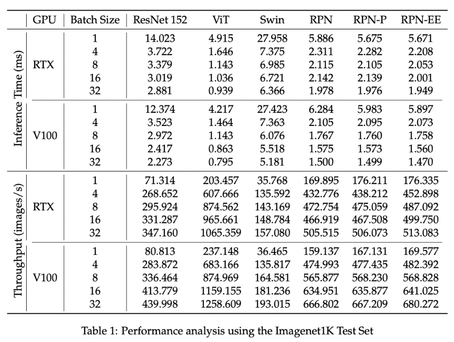
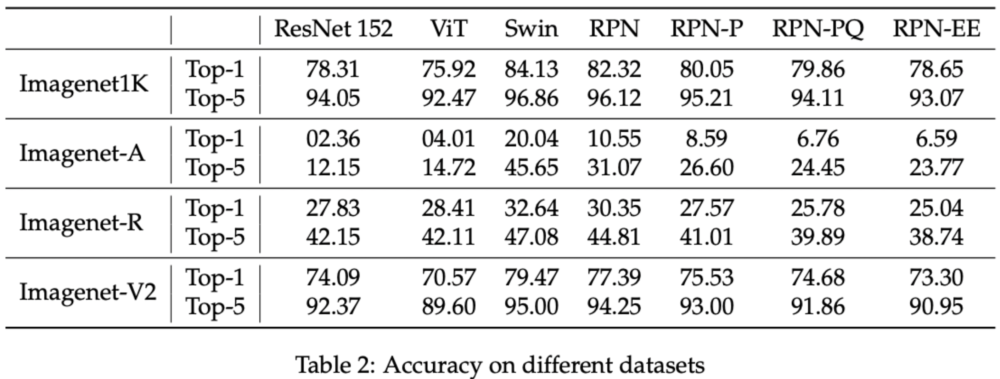
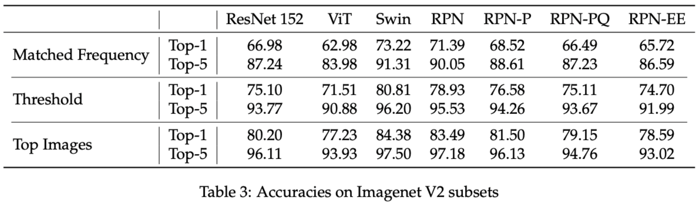
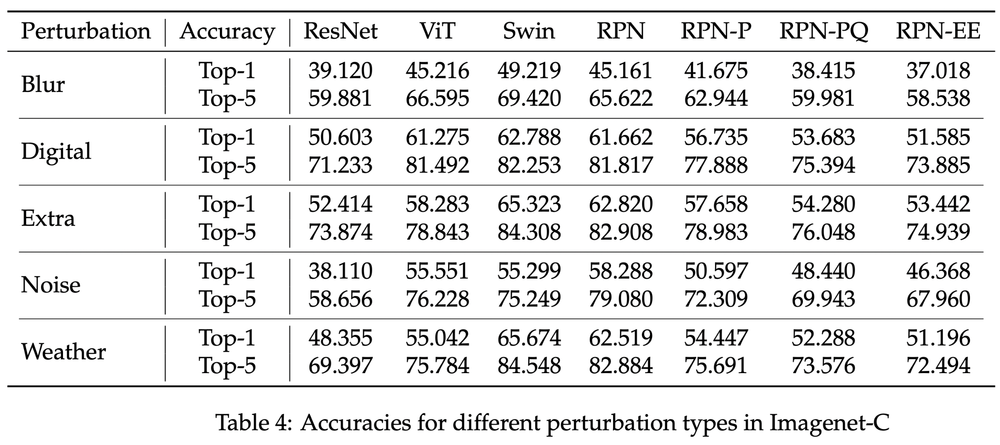
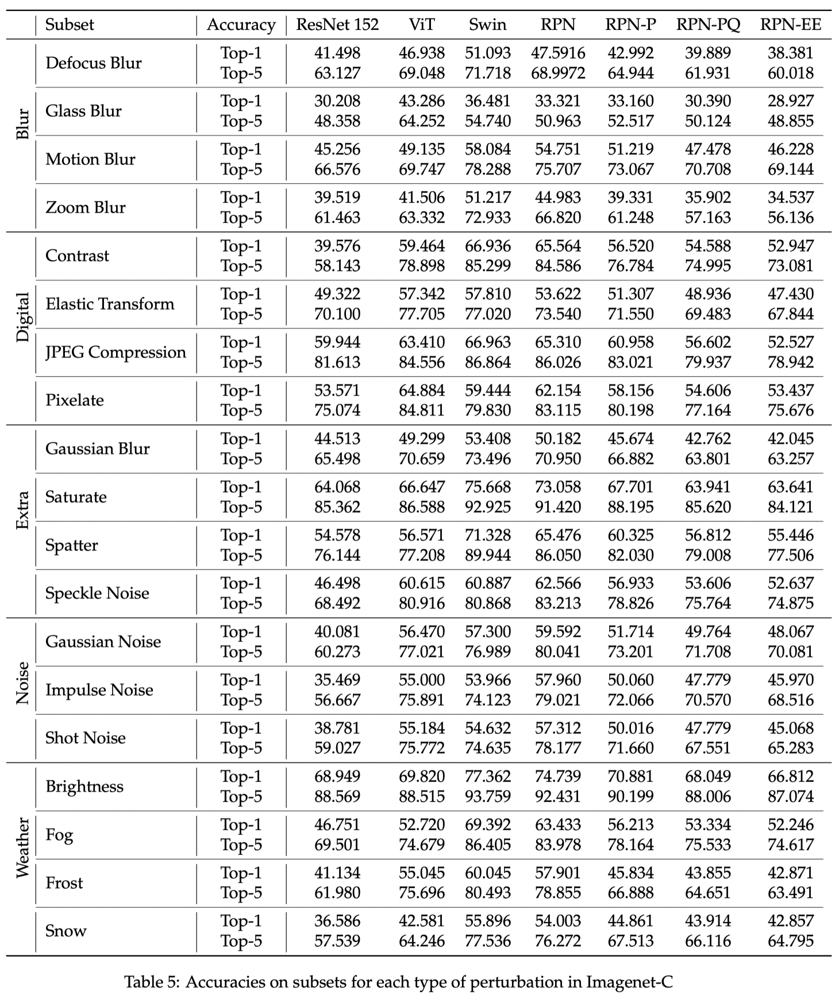
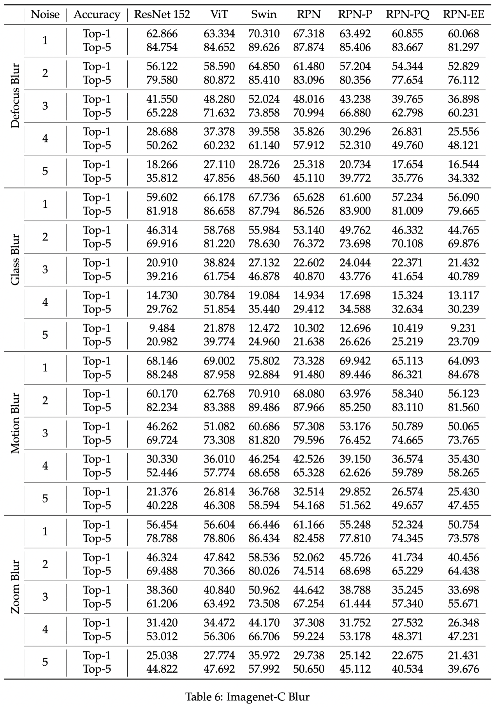
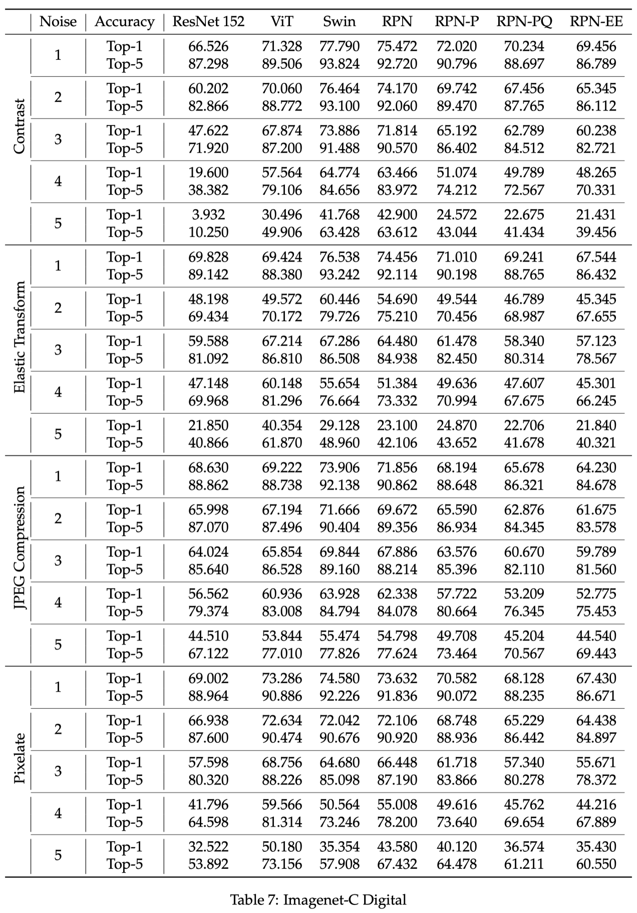
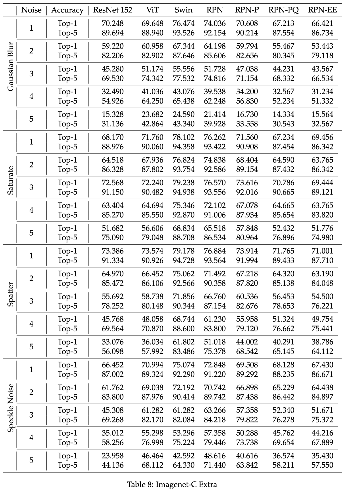
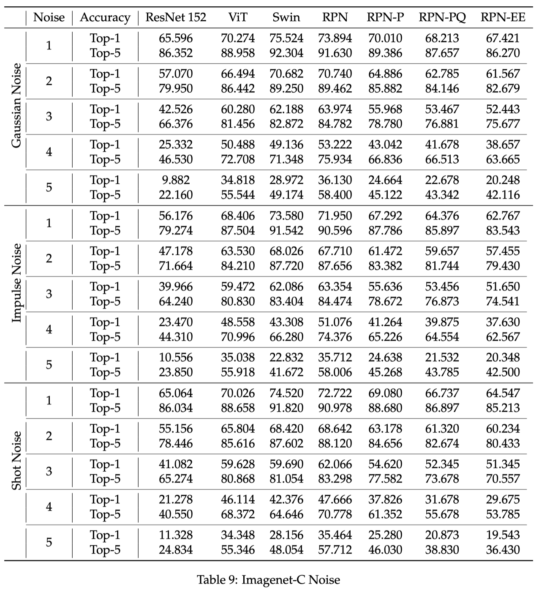
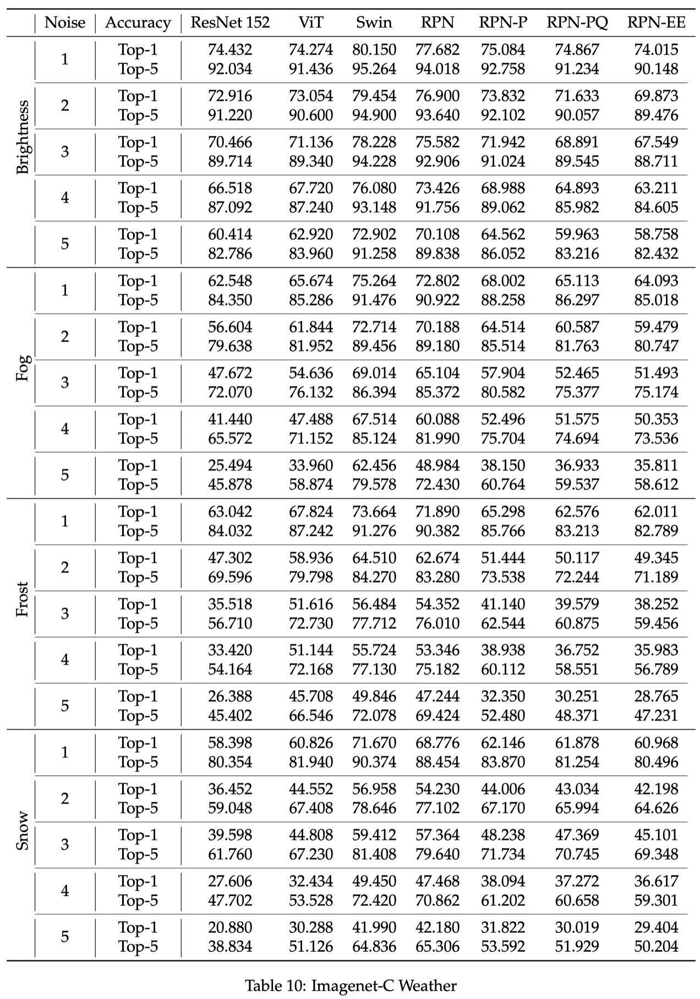

# ECEGY-9143: High-Performance Machine Learning Capstone Project

> ## Setup
>
> **Clone the repo**
>
> ```
> git clone git@github.com:ayush1399/ECEGY-9143_High-Performance-Machine-Learning_Capstone-Project.git
> ```
>
> **and pull in the submodules**
>
> ```
> git submodule update --init --recursive
> ```
>
> **Then create a new conda environment using the environment file in the repo**
>
> ```
> conda env create -f environment.yml
> ```
>
> ### Configuration
>
> - Download all datasets from the provided links and set them up. Update the root directory for datasets in the config.yaml file.
> - For imagenetV2 you can specify which subset should be used or all datasets should be used in the config.yaml file.
> - Similarly for ImagenetC you can specify the perturbation set, perturbation type and noise level in the config.yaml file.
>
> ### Testing accuracy:
>
> To test accuracy choose your model (ResNet, ViT, Swin_V2, RPN, RPN_P, RPN_PQ, RPN_EE) and choose your dataset (Imagenet1KVal, ImagenetA, ImagenetC, ImagenetR, ImagenetV2)
>
> ```
> python eval.py --dataset ImagenetA --eval_mode acc --model ResNet --workers 4
> ```
>
> Note: by default you will get top-1 accuracy. To get top-5 accuracy simply pass the top5 flag as below:\_
>
> ```
> python eval.py --dataset ImagenetR --eval_mode acc --model ViT --workers 4 --top5
> ```
>
> ### Testing throughput
>
> Similar to accuracy, you can specify the number of workers, batch size, model and dataset. The allowed models are (ResNet, ViT, Swin_V2, RPN, RPN_P, RPN_PQ, RPN_EE) and datasets are (Imagenet1KTrain, Imagenet1KVal, Imagenet1KTest, ImagenetA, ImagenetC, ImagenetR, ImagenetV2)
>
> ```
> python eval.py --dataset Imagenet1KTest --eval_mode perf --model ViT --batch_size 8 --workers 4
> ```

---

> ## Datasets
>
> ### Imagenet1K
>
> The imagenet 1K dataset is available at: [https://www.image-net.org/challenges/LSVRC/](https://www.image-net.org/challenges/LSVRC/). You will have to download all three (train, test and val) splits.
> _Note: You will have to sign up for an account and agree to their terms and conditions to access the dataset._
>
> ### Imagenet-A
>
> Imagenet-A is available here - [https://people.eecs.berkeley.edu/~hendrycks/imagenet-a.tar](https://people.eecs.berkeley.edu/~hendrycks/imagenet-a.tar)
>
> ### Imagenet-C
>
> Imagenet-C is available here - [https://zenodo.org/records/2235448](https://zenodo.org/records/2235448)
>
> ### Imagenet-R
>
> The imagenet-r dataset can be downloaded here - [https://people.eecs.berkeley.edu/~hendrycks/imagenet-r.tar](https://people.eecs.berkeley.edu/~hendrycks/imagenet-r.tar)
>
> ### Imagenet-V2
>
> The three Imagenet-v2 sets (matched-frequency, threshold and top-images) are available here - [https://huggingface.co/datasets/vaishaal/ImageNetV2/tree/main](https://huggingface.co/datasets/vaishaal/ImageNetV2/tree/main)

---

> # Results
>
> ## Throughputs
>
> 
>
> ## Accuracy - All datasets
>
> 
>
> ## Accuracy - ImagenetV2 subsets
>
> 
>
> ## Accuracy - ImagenetC by perturbation categories
>
> 
>
> ## Accuracy - ImagenetC by perturbation types
>
> 
>
> ## Accuracy - ImagenetC noise level granularity for each perturbation
>
>  >  >  >  > 
